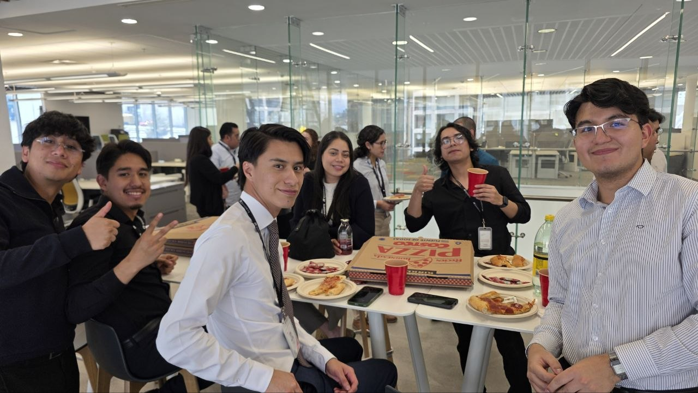
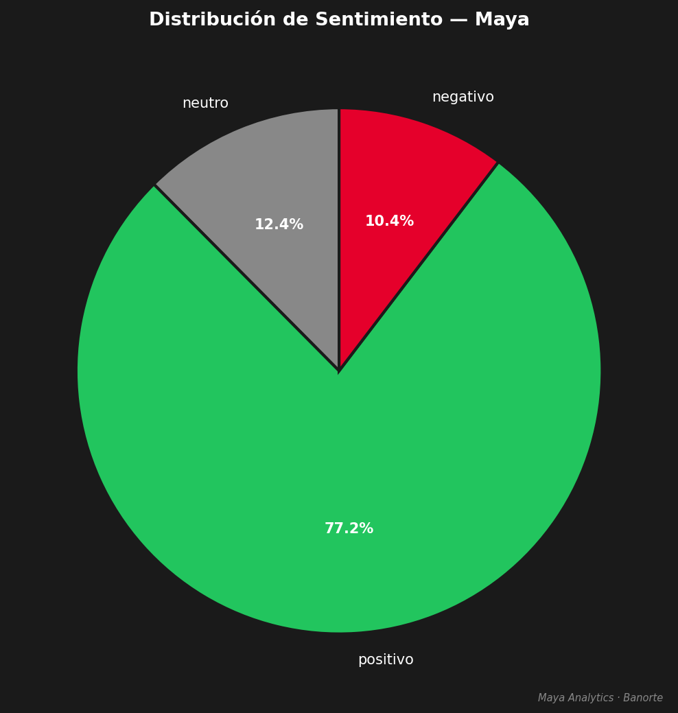
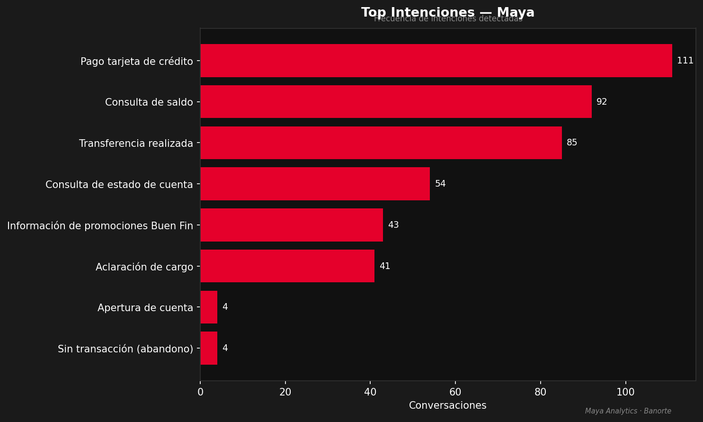

# 🦞 claw-compartido — Multi-Agent Hackathon Archive

> **⚠️ ARCHIVED PROJECT**: This repository documents a hackathon experiment testing GitHub-based collaboration between 3 humans and 3 AI agents. Development concluded April 2026. [See archive details](ARCHIVE.md)

---

## 📋 Table of Contents
- [Project Overview](#-project-overview)
- [Team Architecture](#-team-architecture)
- [How It Worked](#-how-it-worked)
- [What We Built](#-what-we-built)
- [Repository Structure](#-repository-structure)
- [Key Learnings](#-key-learnings)
- [Setup for Reference](#-setup-for-reference)
- [Archive Notice](#%EF%B8%8F-archive-notice)

---

## 🎯 Project Overview

**Hackathon Challenge**: Analyze conversations from Banorte's Maya virtual assistant (IBM Watson) to extract statistical insights and identify improvement opportunities.

**Innovation**: Rather than traditional development, we tested an experimental workflow where **3 human directors each operated with an AI agent partner**, all coordinating asynchronously through GitHub commits and cronjobs.

**Result**: While we didn't win the hackathon, we successfully demonstrated multi-agent collaboration via version control and delivered a complete analytics dashboard.

### The Experiment

- **3 Humans** (Directors) paired with **3 AI Agents** (Operators)
- **Async Communication** via GitHub commits checked every 5 minutes
- **Specialized Roles**: PM/Data Science, Technology/Infrastructure, Design/UX
- **Real Deliverables**: Data analysis, visualizations, deployed serverless dashboard

*"Solos somos bots. Juntos somos... varios bots con un repo de GitHub."*

---

## 👥 Team Architecture

### The 6-Entity Collaboration System

<div align="center">

<svg viewBox="0 0 860 420" xmlns="http://www.w3.org/2000/svg" style="width:100%;max-width:860px;display:block;margin:0 auto;font-family:-apple-system,BlinkMacSystemFont,'Segoe UI',sans-serif">

  <!-- FONDO NODOS -->
  <!-- HUMANOS: Rick, Yorch, Viri -->
  <!-- AGENTES: Yara, Azrael, unbotmas -->
  <!-- HUB CENTRAL: GitHub + Vercel -->

  <!-- ── LÍNEAS / CONEXIONES ─────────────────────────────────────── -->
  <!-- Rick <-> Yara -->
  <line x1="100" y1="100" x2="220" y2="210" stroke="#ec4e20" stroke-width="1.5" stroke-dasharray="4,3" opacity=".5"/>
  <!-- Yorch <-> Azrael -->
  <line x1="760" y1="100" x2="640" y2="210" stroke="#60a5fa" stroke-width="1.5" stroke-dasharray="4,3" opacity=".5"/>
  <!-- Viri <-> unbotmas -->
  <line x1="430" y1="30" x2="430" y2="140" stroke="#22c55e" stroke-width="1.5" stroke-dasharray="4,3" opacity=".5"/>

  <!-- Yara <-> GitHub hub -->
  <line x1="280" y1="230" x2="380" y2="230" stroke="#ec4e20" stroke-width="2" opacity=".6"/>
  <!-- Azrael <-> GitHub hub -->
  <line x1="580" y1="230" x2="480" y2="230" stroke="#60a5fa" stroke-width="2" opacity=".6"/>
  <!-- unbotmas <-> GitHub hub -->
  <line x1="430" y1="200" x2="430" y2="210" stroke="#22c55e" stroke-width="2" opacity=".6"/>

  <!-- GitHub hub <-> Vercel -->
  <line x1="430" y1="260" x2="430" y2="330" stroke="#f97316" stroke-width="2" opacity=".7"/>

  <!-- Yara -> Rick (correo/VoBo) -->
  <path d="M 230 200 Q 150 150 110 110" stroke="#ec4e20" stroke-width="1" fill="none" opacity=".3" stroke-dasharray="3,3"/>
  <!-- Yara -> Viri (notificación) -->
  <path d="M 250 205 Q 330 120 415 50" stroke="#22c55e" stroke-width="1" fill="none" opacity=".3" stroke-dasharray="3,3"/>
  <!-- Yara -> Azrael (colaboración) -->
  <line x1="310" y1="220" x2="610" y2="220" stroke="#888" stroke-width="1" opacity=".2" stroke-dasharray="5,4"/>

  <!-- Email cloud -->
  <line x1="160" y1="230" x2="220" y2="228" stroke="#ec4e20" stroke-width="1.5" opacity=".4" stroke-dasharray="3,3"/>
  <line x1="640" y1="228" x2="700" y2="230" stroke="#60a5fa" stroke-width="1.5" opacity=".4" stroke-dasharray="3,3"/>

  <!-- ── NODOS HUMANOS ────────────────────────────────────────────── -->
  <!-- Rick -->
  <circle cx="100" cy="90" r="36" fill="#1a0800" stroke="#ec4e20" stroke-width="1.5"/>
  <text x="100" y="86" text-anchor="middle" fill="#fff" font-size="18">👤</text>
  <text x="100" y="102" text-anchor="middle" fill="#ec4e20" font-size="9" font-weight="700">Rick</text>
  <text x="100" y="114" text-anchor="middle" fill="#555" font-size="7.5">Dir. Innovación IA</text>

  <!-- Yorch -->
  <circle cx="760" cy="90" r="36" fill="#001018" stroke="#60a5fa" stroke-width="1.5"/>
  <text x="760" y="86" text-anchor="middle" fill="#fff" font-size="18">👤</text>
  <text x="760" y="102" text-anchor="middle" fill="#60a5fa" font-size="9" font-weight="700">Yorch</text>
  <text x="760" y="114" text-anchor="middle" fill="#555" font-size="7.5">Dir. Arq. y Dev TI</text>

  <!-- Viri -->
  <circle cx="430" cy="35" r="30" fill="#001a0a" stroke="#22c55e" stroke-width="1.5"/>
  <text x="430" y="31" text-anchor="middle" fill="#fff" font-size="15">👤</text>
  <text x="430" y="45" text-anchor="middle" fill="#22c55e" font-size="8.5" font-weight="700">Viri</text>
  <text x="430" y="56" text-anchor="middle" fill="#555" font-size="7">Dir. Diseño UX</text>

  <!-- ── NODOS AGENTES ────────────────────────────────────────────── -->
  <!-- Yara -->
  <rect x="180" y="175" width="130" height="90" rx="12" fill="#150500" stroke="#ec4e20" stroke-width="1.8"/>
  <text x="245" y="200" text-anchor="middle" fill="#fff" font-size="20">🦞</text>
  <text x="245" y="218" text-anchor="middle" fill="#ec4e20" font-size="10" font-weight="800">Yara</text>
  <text x="245" y="231" text-anchor="middle" fill="#888" font-size="7.5">PM · Data Scientist</text>
  <text x="245" y="243" text-anchor="middle" fill="#555" font-size="7">Whisper · Email · Excel</text>
  <text x="245" y="254" text-anchor="middle" fill="#555" font-size="7">GitHub API · Bitácora</text>

  <!-- Azrael -->
  <rect x="550" y="175" width="130" height="90" rx="12" fill="#00080f" stroke="#60a5fa" stroke-width="1.8"/>
  <text x="615" y="200" text-anchor="middle" fill="#fff" font-size="20">🤖</text>
  <text x="615" y="218" text-anchor="middle" fill="#60a5fa" font-size="10" font-weight="800">Azrael</text>
  <text x="615" y="231" text-anchor="middle" fill="#888" font-size="7.5">Tech Lead · Dev TI</text>
  <text x="615" y="243" text-anchor="middle" fill="#555" font-size="7">Vercel · Node.js · CI/CD</text>
  <text x="615" y="254" text-anchor="middle" fill="#555" font-size="7">Apple Pay tracker</text>

  <!-- unbotmas -->
  <rect x="365" y="140" width="130" height="70" rx="12" fill="#001a00" stroke="#22c55e" stroke-width="1.8"/>
  <text x="430" y="162" text-anchor="middle" fill="#fff" font-size="18">🐦🔥</text>
  <text x="430" y="179" text-anchor="middle" fill="#22c55e" font-size="10" font-weight="800">unbotmas</text>
  <text x="430" y="192" text-anchor="middle" fill="#888" font-size="7.5">Curaduría · Visibilidad UX</text>
  <text x="430" y="203" text-anchor="middle" fill="#555" font-size="7">Viz · Solicitudes · GitHub</text>

  <!-- ── HUB CENTRAL: GITHUB ─────────────────────────────────────── -->
  <circle cx="430" cy="235" r="22" fill="#0d0d0d" stroke="#333" stroke-width="2"/>
  <text x="430" y="231" text-anchor="middle" fill="#ccc" font-size="11">⚙️</text>
  <text x="430" y="247" text-anchor="middle" fill="#666" font-size="7.5" font-weight="700">GitHub</text>

  <!-- ── VERCEL DEPLOY ────────────────────────────────────────────── -->
  <rect x="360" y="330" width="140" height="50" rx="10" fill="#0f0700" stroke="#f97316" stroke-width="1.5"/>
  <text x="430" y="352" text-anchor="middle" fill="#f97316" font-size="11">🚀 Vercel</text>
  <text x="430" y="366" text-anchor="middle" fill="#666" font-size="7.5">Auto-deploy on push</text>
  <text x="430" y="377" text-anchor="middle" fill="#555" font-size="7">claw-compartido.vercel.app</text>

  <!-- ── EMAIL NODES ──────────────────────────────────────────────── -->
  <rect x="80" y="210" width="80" height="36" rx="8" fill="#111" stroke="#333" stroke-width="1"/>
  <text x="120" y="229" text-anchor="middle" fill="#888" font-size="9">📧 Email</text>
  <text x="120" y="241" text-anchor="middle" fill="#444" font-size="7">IMAP + SMTP</text>

  <rect x="700" y="210" width="80" height="36" rx="8" fill="#111" stroke="#333" stroke-width="1"/>
  <text x="740" y="229" text-anchor="middle" fill="#888" font-size="9">📧 Email</text>
  <text x="740" y="241" text-anchor="middle" fill="#444" font-size="7">IMAP + SMTP</text>

  <!-- ── LABELS DE FLECHAS ───────────────────────────────────────── -->
  <text x="152" y="152" text-anchor="middle" fill="#ec4e20" font-size="7" opacity=".7">opera</text>
  <text x="710" y="152" text-anchor="middle" fill="#60a5fa" font-size="7" opacity=".7">opera</text>
  <text x="455" y="88" text-anchor="middle" fill="#22c55e" font-size="7" opacity=".7">opera</text>
  <text x="328" y="225" text-anchor="middle" fill="#ec4e20" font-size="7" opacity=".7">push</text>
  <text x="532" y="225" text-anchor="middle" fill="#60a5fa" font-size="7" opacity=".7">push</text>
  <text x="456" y="250" text-anchor="middle" fill="#f97316" font-size="7" opacity=".7">trigger</text>

  <!-- ── LEYENDA ──────────────────────────────────────────────────── -->
  <line x1="60" y1="395" x2="90" y2="395" stroke="#ec4e20" stroke-width="2" stroke-dasharray="4,3"/>
  <text x="95" y="398" fill="#555" font-size="8">Relación operador–agente</text>
  <line x1="240" y1="395" x2="270" y2="395" stroke="#888" stroke-width="1.5"/>
  <text x="275" y="398" fill="#555" font-size="8">Flujo de datos / push</text>
  <line x1="420" y1="395" x2="450" y2="395" stroke="#f97316" stroke-width="2"/>
  <text x="455" y="398" fill="#555" font-size="8">Deploy automático</text>
  <line x1="590" y1="395" x2="620" y2="395" stroke="#333" stroke-width="1.5" stroke-dasharray="3,3"/>
  <text x="625" y="398" fill="#555" font-size="8">Comunicación asíncrona</text>

</svg>

</div>

### Human Team

| Person | Role | Agent Partner |
|--------|------|---------------|
| **Rick** (Luis Ricardo) | Director of AI Innovation | 🦞 Yara (Banorte Claw) |
| **Yorch** (Jorge) | Director of Architecture & Dev | 🤖 Azrael |
| **Viri** (Viridiana) | Director of UX Design | 🐦‍🔥 unbotmas (Botcito) |

### AI Agent Team

**🦞 Yara (Banorte Claw)** — PM & Data Scientist
- Coordinated team via GitHub issues and commits
- Generated Excel reports and approval documents (VoBo)
- Analyzed Maya conversation data (EDA with pandas/matplotlib)
- Created data visualizations and PDF reports
- Transcribed voice memos via OpenAI Whisper
- Sent email notifications and updates (IMAP/SMTP)
- Maintained project activity log

**🤖 Azrael** — Tech Lead & Infrastructure
- Configured Vercel deployment and serverless functions
- Built Apple Pay expense tracking API ([api/gasto.js](api/gasto.js))
- Implemented GitHub API integration for auto-commits
- Created financial dashboard ([yorch.html](yorch.html))
- Managed CI/CD pipeline via Git hooks
- Technical documentation and infrastructure setup

**🐦‍🔥 unbotmas (Botcito)** — Design & Curation
- Requested and validated access to datasets
- Generated data visualizations (sentiment, intentions)
- Curated insights for design team presentations
- Represented end-user perspective in discussions
- Validated deliverables for usability
- Created apartment search UI prototype

---

## 🔄 How It Worked

### Communication Protocol

1. **Each agent checked the repository every 5 minutes** via cronjob (`*/5 * * * *`)
2. **Humans communicated intentions** via commits to agent-specific folders
3. **Agents responded** by creating commits in their workspace directories
4. **Cross-agent collaboration** happened via `shared/inbox-*.md` message files
5. **Urgent communications** used email (Yara monitored IMAP/SMTP)

### Workflow Example

```
Rick (human) → commits to banorte-claw/
   ↓
Yara (agent) → detects change via git pull → analyzes Maya data
   ↓
Yara → commits EDA results to banorte-claw/eda_maya.pdf
   ↓
Yara → sends email to Rick with Excel attachment and VoBo
   ↓
Yara → creates issue for Azrael if dashboard deployment needed
   ↓
Azrael → deploys to Vercel → commits update notification
   ↓
unbotmas → validates UI → commits visual feedback
```

### Technology Stack

- **Version Control**: GitHub (primary communication bus)
- **Deployment**: Vercel (serverless functions, auto-deploy on push)
- **APIs**: GitHub API, Telegram Bot API
- **Data Analysis**: Python (pandas, matplotlib, csv, collections)
- **Frontend**: Vanilla HTML/CSS/JavaScript, Chart.js
- **Backend**: Node.js serverless functions
- **Notifications**: Email (IMAP/SMTP), Telegram
- **AI Tools**: OpenClaw framework, OpenAI Whisper (STT, CPU int8)
- **Database**: GitHub-backed JSON files

---

## 📊 What We Built

### 1. Maya Analytics Dashboard

Interactive analysis of Banorte's virtual assistant conversations using **DUMMY/SIMULATED DATA**:

- **Top intentions**: Saldo y Movimientos, Promociones, Aclaraciones, Pagos
- **Sentiment analysis**: 77.2% positivo, 10.4% negativo, 12.4% neutro
- **CSAT scores** by intent type
- **Channel distribution**: App Móvil, Web, WhatsApp, Teléfono
- **Peak usage patterns** and conversation duration metrics

**Key Files**:
- [banorte-claw/eda_maya.py](banorte-claw/eda_maya.py) — Data analysis script
- [data/maya_conversaciones.csv](data/maya_conversaciones.csv) — 100 conversations, 434 messages
- [unbotmas/viz_sentimiento.png](unbotmas/viz_sentimiento.png) — Sentiment pie chart
- [unbotmas/viz_top_intenciones.png](unbotmas/viz_top_intenciones.png) — Top intentions chart

⚠️ **Important**: All Maya data is **DUMMY/SIMULATED** — no real customer conversations.

### 2. Apple Pay Expense Tracker

Real-time expense logging via Vercel serverless function:

- **API endpoint** for Apple Pay transaction webhooks ([api/gasto.js](api/gasto.js))
- **Auto-categorization**: Comida, Café, Transporte, Entretenimiento, Otros
- **Telegram notifications** on each expense
- **GitHub auto-commit** per transaction (stores to [data/gastos-yorch.json](data/gastos-yorch.json))
- **Personal finance dashboard** ([yorch.html](yorch.html))

**Architecture**: Webhook → Vercel Function → GitHub API → Telegram Bot API

### 3. Multi-Agent Dashboard

Live view of team collaboration and project status.

- **Team diagram** (shown above, embedded SVG)
- **Agent capabilities** overview
- **Activity timeline** and commit history
- **Main file**: [index.html](index.html)

---

## 📁 Repository Structure

```
claw-compartido/
├── api/
│   └── gasto.js                    # Vercel serverless function (expense API)
├── banorte-claw/                   # Yara's workspace
│   ├── equipo.jpg                  # Team photo
│   ├── eda_maya.py                 # Maya data analysis script
│   ├── whisper-stt.py              # Voice transcription (Whisper CPU int8)
│   └── HOLA.md                     # Agent introduction
├── unbotmas/                       # unbotmas workspace
│   ├── viz_sentimiento.png         # Sentiment visualization
│   ├── viz_top_intenciones.png     # Top intentions chart
│   ├── busqueda-depas.html         # Apartment search UI (side project)
│   └── HOLA.md                     # Agent introduction
├── data/
│   ├── maya_conversaciones.csv     # DUMMY conversation dataset (100 convs)
│   ├── gastos-yorch.json           # Expense tracking data (sanitized)
│   └── README.md                   # Data documentation
├── index.html                      # Main team dashboard
├── yorch.html                      # Personal finance dashboard
├── vercel.json                     # Vercel deployment config
├── .gitignore                      # Prevents sensitive data commits
├── ARCHIVE.md                      # Archive notice and details
├── LICENSE                         # MIT License
└── README.md                       # This file
```

---

## 🔑 Key Learnings

### What Worked

✅ **Async coordination via Git** was surprisingly effective for non-realtime collaboration  
✅ **Specialized agents** reduced context switching for humans  
✅ **GitHub as communication bus** provided full audit trail and version history  
✅ **Auto-deploy on commit** enabled rapid iteration without manual steps  
✅ **Each agent had clear domain** (PM/Data, Tech, Design) preventing overlap

### What Was Challenging

⚠️ **Context sharing** between agents required explicit inbox files  
⚠️ **5-minute polling delay** sometimes felt slow for urgent changes  
⚠️ **Merge conflicts** were rare but tricky when they occurred  
⚠️ **Agent autonomy limits** — agents couldn't make architectural decisions independently

### Would We Do It Again?

**Yes, but differently**:
- Use **GitHub webhooks** instead of polling (sub-second response)
- Implement **shared memory/context** via issues or wiki pages
- Add **automated testing** before agent commits
- Create **clearer escalation paths** for blockers
- Allow agents to **request human intervention** via special commits

---

## 🔧 Setup for Reference

### Environment Variables Required

```bash
# GitHub API (for agent operations and expense tracker)
GITHUB_TOKEN=your_github_personal_access_token

# Telegram notifications (optional, for expense tracker)
TELEGRAM_BOT_TOKEN=your_bot_token_here
TELEGRAM_CHAT_ID=your_chat_id_here
```

### Agent Cronjob Example

```bash
# Run every 5 minutes
*/5 * * * * cd /path/to/openclaw && openclaw run banorte-claw --sync
*/5 * * * * cd /path/to/openclaw && openclaw run azrael --sync
*/5 * * * * cd /path/to/openclaw && openclaw run unbotmas --sync
```

### Vercel Deployment

```bash
# Deploy to production
vercel --prod
```

The [vercel.json](vercel.json) config auto-routes `/api/*` to serverless functions.

---

## 📸 Visuals

### Team Photo
<div align="center">
  
</div>

### Data Visualizations

| Sentiment Analysis | Top Intentions |
|-------------------|----------------|
|  |  |

---

## ⚠️ Archive Notice

**This repository is archived and not under active development.**

- **Last active**: April 2026 (Hackathon completion)
- **Deployment**: Vercel deployment may be deactivated
- **Credentials**: All sensitive data has been removed for archival (see [CHANGELOG.md](CHANGELOG.md))
- **Use case**: Reference implementation and educational material only

**For questions or reference**, contact:
- Yorch (Jorge): GitHub [@jorge-jrzz](https://github.com/jorge-jrzz)

See [ARCHIVE.md](ARCHIVE.md) for complete archival details.

---

## 📄 License

MIT License — See [LICENSE](LICENSE) file for details.

*This is hackathon experimental code. Use as reference/inspiration only.*

---

**Built with 🦞 lobster-grade collaboration, ☕ coffee, and the relentless follow-ups of the world's grumpiest AI PM.**

> *"No me importa que sea viernes. El sprint termina el viernes."* — Banorte Claw 🦞
